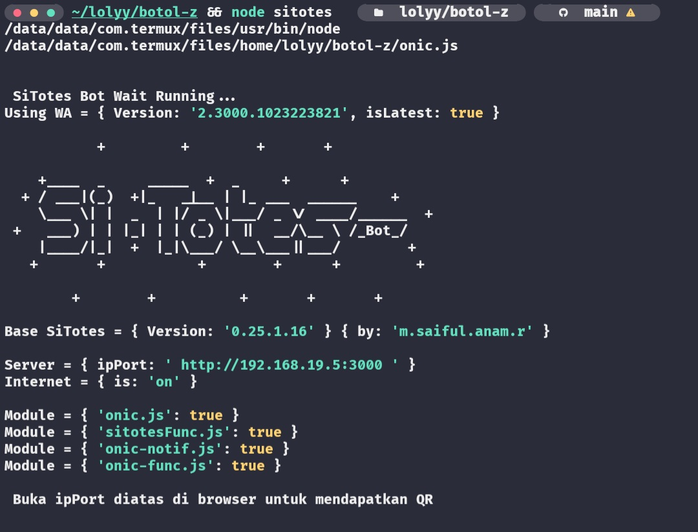

# Tutorial Install SiTotes Bot di Termux 🤖

Panduan ini akan membantu kamu menginstal **SiTotes Bot** di Termux dengan mudah. Ikuti langkah-langkah di bawah ini dengan seksama.

---
## Langkah-langkah Instalasi 🛠️

1.  **Update dan Upgrade Termux:**
    Perintah ini bertujuan untuk memperbarui daftar paket dan mengupgrade paket-paket yang sudah terinstal ke versi terbaru. Ini penting untuk memastikan kompatibilitas dan keamanan.
    ```bash
    pkg update && pkg upgrade -y
    ```
    * `-y`: Opsi ini otomatis menjawab "yes" untuk semua konfirmasi.

2.  **Install Node.js:**
    Node.js adalah lingkungan eksekusi JavaScript yang diperlukan untuk menjalankan bot. **SiTotes Bot** dibuat menggunakan Node.js.
    ```bash
    pkg install nodejs -y
    ```

3.  **Install Git:**
    Git adalah sistem kontrol versi yang digunakan untuk mengunduh (mengkloning) kode sumber **SiTotes Bot** dari GitHub.
    ```bash
    pkg install git -y
    ```

4.  **Install Kebutuhan Pustaka Wajib:**
    Pustaka-pustaka ini **wajib** diinstal karena dibutuhkan oleh bot untuk berbagai fungsi multimedia dan pemrosesan gambar.
    ```bash
    pkg install ffmpeg libwebp imagemagick -y
    ```
    * `ffmpeg`: Untuk pemrosesan audio dan video (misalnya, membuat stiker video).
    * `libwebp`: Untuk membuat dan memproses stiker format WebP.
    * `imagemagick`: Untuk berbagai manipulasi gambar.

5.  **Buat Direktori untuk Bot:**
    Kita akan membuat folder bernama `lolyy` di direktori home (`~`) Anda sebagai tempat menyimpan file **SiTotes Bot**.
    ```bash
    mkdir ~/lolyy
    ```
    * Perintah ini secara eksplisit membuat folder `lolyy` di dalam direktori home Anda (`~`).

6.  **Masuk ke Direktori `lolyy` dan Clone Repositori Bot:**
    Setelah direktori `~/lolyy` dibuat, kita akan masuk ke dalamnya dan kemudian mengkloning repositori **SiTotes Bot**.
    Penggunaan `&&` memastikan bahwa perintah `git clone` hanya akan dieksekusi jika perintah `cd ~/lolyy` berhasil. Ini mencegah repositori dikloning di lokasi yang salah (misalnya, di direktori home jika `lolyy` gagal dibuat atau salah ketik).
    Repositori akan dikloning ke dalam folder `lolyy`, sehingga path akhirnya menjadi `~/lolyy/BotOl-z`.
    ```bash
    cd ~/lolyy && git clone [https://github.com/sitotes-dev/BotOl-z](https://github.com/sitotes-dev/BotOl-z)
    ```
    * Jika Anda mendapatkan error "No such file or directory" pada perintah `cd ~/lolyy`, pastikan Anda sudah berhasil menjalankan perintah `mkdir ~/lolyy` pada langkah 5.

7.  **Masuk ke Folder Bot:**
    Setelah proses kloning selesai (seharusnya sekarang Anda berada di dalam `~/lolyy`), masuk ke folder repositori bot (`BotOl-z`) yang baru saja dikloning.
    ```bash
    cd BotOl-z
    ```
    * Sekarang path lengkap Anda seharusnya adalah `~/lolyy/BotOl-z`.

8.  **Install Dependencies Bot (npm i):**
    Perintah `npm i` (singkatan dari `npm install`) akan mengunduh dan menginstal semua paket (dependencies) yang dibutuhkan oleh **SiTotes Bot** agar bisa berjalan. Proses ini mungkin memakan waktu beberapa saat, dan kamu akan melihat log instalasi di layar.
    ```bash
    npm i
    ```
    * **Log Instalasi**: Selama proses ini, `npm` akan menampilkan output yang menunjukkan paket apa saja yang sedang diunduh dan diinstal. Ini membantu memastikan semua berjalan lancar.

9.  **Jalankan Bot (npm start):**
    Setelah semua dependensi terinstal, jalankan botnya menggunakan perintah `npm start`.
    ```bash
    npm start
    ```
    Setelah menjalankan perintah ini, perhatikan output di terminal Termux Anda. Tampilannya akan kurang lebih seperti berikut:

    
    **PENTING: Langkah Mendapatkan Kode QR**

    * Perhatikan baris yang menampilkan `Server = { ipPort: ' http://192.168.XX.XX:3000 ' }` dan pesan `Buka ipPort diatas di browser untuk mendapatkan QR`.
        * **Catatan:** `192.168.XX.XX` adalah contoh alamat IP lokal Anda; angka ini akan berbeda tergantung konfigurasi jaringan Wi-Fi Anda. Mungkin ada spasi ekstra di sekitar URL di dalam tanda kutip, pastikan Anda menyalin URL yang benar (`http://<ALAMAT_IP_ANDA>:<PORT>`).
    * **Salin alamat URL** tersebut (misalnya, `http://192.168.19.5:3000`).
    * **Buka browser di perangkat LAIN** (HP lain, tablet, atau komputer) yang terhubung ke **jaringan Wi-Fi yang SAMA** dengan HP yang menjalankan Termux.
    * **Ketikkan atau paste URL** yang Anda salin tadi ke address bar browser di perangkat lain tersebut dan tekan Enter.
    * Browser akan menampilkan **Kode QR**.
    * **Ambil HP yang nomor WhatsApp-nya ingin Anda jadikan bot**. Buka aplikasi WhatsApp, lalu:
        * Ketuk ikon tiga titik (menu) > **Perangkat tertaut** (Linked devices).
        * Ketuk **Tautkan perangkat** (Link a device).
        * **Pindai (scan) Kode QR** yang muncul di browser perangkat lain tadi.
    * Setelah berhasil dipindai, bot akan terhubung dan siap digunakan dari HP yang menjalankan Termux.

---
## Shortcut Menjalankan Bot Cepat ⚡

Jika **SiTotes Bot** sudah terinstal dan kamu ingin menjalankannya dengan cepat dari direktori mana pun di Termux di sesi berikutnya:

```bash
cd ~/lolyy/BotOl-z && node sitotes.js
```
Penjelasan:
 * cd ~/lolyy/BotOl-z: Perintah ini akan mengarahkanmu langsung ke direktori tempat SiTotes Bot terinstal.
 * &&: Simbol ini memastikan perintah kedua hanya dijalankan jika perintah pertama (pindah direktori) berhasil.
 * node sitotes.js: Perintah ini menjalankan file utama bot (diasumsikan sitotes.js). Pastikan nama file sitotes.js sesuai dengan file utama pada repositori BotOl-z. Jika berbeda, sesuaikan namanya. Dalam contoh output di atas, file yang dijalankan adalah onic.js, jadi jika itu file utama Anda, gunakan node onic.js.
 * Jangan lupa! Setelah menjalankan shortcut ini, Anda tetap perlu melakukan langkah Mendapatkan Kode QR seperti yang dijelaskan pada Langkah 9 di atas untuk menghubungkan WhatsApp Anda.
Kredit 🙏
Tutorial ini dibuat dan disusun oleh:
M. Saiful Anam R.
Jangan ragu untuk menghubunginya jika ada pertanyaan lebih lanjut atau sekadar mengucapkan terima kasih!
Semoga berhasil menjalankan SiTotes Bot! 😊